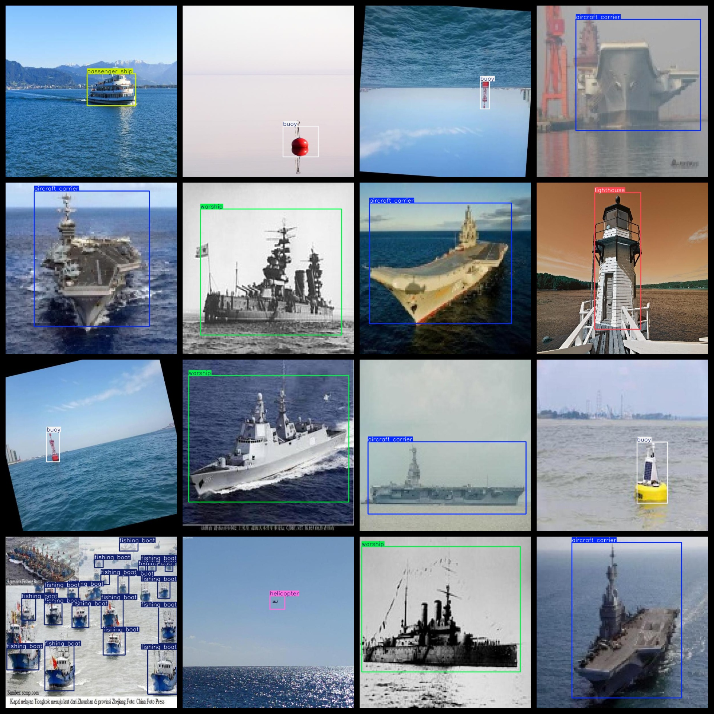

# Sea on Target Detection Dataset 2051 imagesVOC+YOLO

Sea on Target Detection Dataset 2051stretchVOC+YOLO

Dataset format: Pascal VOC format + YOLO format (the txt file does not contain the split path, it only contains jpg images and corresponding VOC format xml files and yolo format txt files)

Number of Images: 2051

Number of xml files: 2051

Number of txt files: 2051

Number of categories: 9

The Github repository is: datasets_sl

["aircraft carrier", "boat", "buoy", "cargo ship", "fishing boat", "helicopter", "lighthouse", "passenger ship", "warship"]

Aircraft carriers, ships, buoys, cargo ships, fishing boats, helicopters, lighthouses, passenger ships, warships

Number of boxes labeled in each category:

Aircraft carrier hull number = 317

Boat Frames = 338

The number of buoys is 283.

The number of cargo ships is 419.

fishing boat frame count = 321

Helicopter frames = 372

lighthouse frame count = 310

Passenger ship frames = 330

The ship's frame count is 380.

Total number of frames: 3070

Number of images per category:

Aircraft carriers have a total of 302 images.

Boat occupies 168 images.

Number of images owned by buoy = 261

Cargo ship owning picture count = 225

Fishing boat ownership images = 231

Helicopter ownership image count = 229

Lighthouse occupies 298 images.

Passenger ship ownership image count = 209

Warship's possession count = 300

Image resolution: 600x600

Use the labeling tool: labelImg

Dataset Augmentation: No

Rules for annotation: Draw a rectangle around the category.

Important note: The dataset does not have been divided into training, validation, and testing sets.

Special Disclaimer: This dataset does not guarantee the accuracy of the trained models or weight files.

Annotation and image details are as follows:

## Images

---

Here is a pay link on Stripe (https://buy.stripe.com/3cs8yP7sY87d0vu9AB). Please contact me lonlonago@foxmail.com after funding $89, and I will send you a complete data files, thank you!

